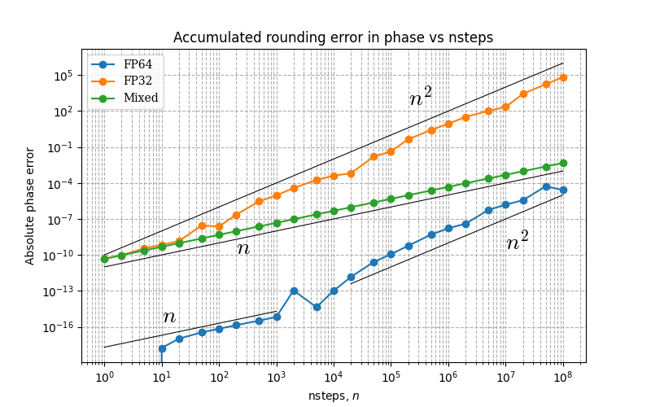

# Accumulation Error and Mixed Precision

## Representation Error

Representation error is the error that arises from representing a number using
a finite number of binary digits. 
Floating-point numbers store a number as a sign, exponent, and mantissa, which
allows exact representation of only certain values (like powers of two). 
Numbers such as 1.0 are represented exactly in binary, but most decimal fractions, e.g. 0.1,
must be rounded to the nearest representable value. 
The difference between the true number and its floating-point representation is
the representation error, which is typically on the order of the machine
epsilon for the given precision.
For example, in double precision, the mantissa has 53 binary bits, corresponding to around
16 decimal places of accuracy. Therefore a number like $10^{-3}$ is only accurate up to $\sim 10^{-19}$,
that is, it has an error in its 16th decimal place.

Representation is usually negligible by itself, but becomes significant when repeated operations accumulate it,
leading to the much larger _accumulation error_.

## Accumulation Error

Accumulation error is the error that results from repeatedly rounding numbers
during numerical operations.  Floating-point arithmetic is not exact: each
operation produces a result that is rounded to the nearest representable value,
introducing an error on the order of machine epsilon, which characterizes the
relative spacing between representable numbers at a given precision.  When such
operations are performed many times in sequence, these small rounding errors
can accumulate, and can grow into the dominant error.

### Double Precision

Consider this code:

```
import numpy as np

# -----------------------------
# Parameters
# -----------------------------
N = 10_000_000       # number of additions
x0 = 1.0             # starting value
dx = 1e-3            # increment

# -----------------------------
# FP64
# -----------------------------
x = np.float64(x0)
for _ in range(N):
    x += np.float64(dx)
error_fp64 = x - (x0 + N*dx)
print(f"FP64 final value: {x:.12f}, accumulated error: {error_fp64:.3e}")
```

This takes the number $x_0 = 1$, and adds $dx=10^{-3}$ to it 10 million times in double precision.

While $x_0=1$ is exact in binary ($1\times 2^0$), both $dx$ and the running sum $x$ will have a **representation error**.
This error accumulates as the loop is iterated, leading to the _accumulation error_.

Let us consider the $k$th iteration of the loop.
In that iteration, we have the $k$th partial sum, $x_k$ and the increment $dx$, both of which are only accurate up to their representation error.
That is, as stored in the computer, $x_k$ and $dx$ are really

$$
(1+\varepsilon_{64}) x_k 
~~~~ \mathrm{and}
~~~~
(1+\varepsilon_{64}) dx  
$$

containing an error proportional to their size.
The error in the increment is constant, and accumulates over every iteration to give a total error

$$
N\varepsilon_{64} dx
$$ 

which increases linearly with loop iterations $N$.

The error in the accumulated sum $x_k$ depends on the value of the sum itself, and is

$$
\sum_{k=1}^{N} \varepsilon_{64} x_k = 
\sum_{k=1}^{N} \varepsilon_{64} (x_0 + k\ dx) = 
\varepsilon_{64} \left(N x_0 + \frac{N(N+1)}{2}\ dx\right).
$$

This contains an $O(N^2)$ term which dominates for a large number of iterations $N$.
Note that for small $N$, the linear term $\varepsilon_{64}N x_0$ can dominate if $x_0\gg dx$.

Note also that while these errors are specific to a constant increment, they are representative of the behaviour of accumulation errors more generally. 
In any case, the representation error $\varepsilon$ is not really a constant, but rather an unknown term with that order of magnitude.
In more general algorithms, we would make estimates for order of magnitude of all terms.

#### Results

Executing the code above, we obtain

```
FP64 final value: 10001.000001578721, accumulated error: 1.579e-06
```
instead of the exact result 10001.

Using the parameters $x_0=1$, $N=10,000,000$, $dx=0.001$ and $\varepsilon_{64}=1\times 10^{-16}$, the three error terms are approximately

$$
N\varepsilon_{64} dx = 10^8 . 10^{-16} . 10^{-3} &= 10^{-11},\\
N \varepsilon_{64} x_0 &= 10^{-8}\\
\varepsilon_{64} \frac{N(N+1)}{2} dx = 10^{-16} \frac{10^{16}}{2} 10^{-3} &= 5\times 10^{-4}. 
$$

This gives an overall estimate of $5\times10^{-4}$. 
While this value is a few orders-of-magnitude too large, it is roughly correct:
the above argument assumes that all errors accumulate, while in practice the error is not of fixed sign
and there would be some degree of cancellation.

### Single Precision

Now consider performing the same operation in single precision:

```
# -----------------------------
# FP32
# -----------------------------
x = np.float32(x0)
for _ in range(N):
    x += np.float32(dx)
error_fp32 = x - np.float64(x0 + N*dx)
print(f"FP32 final value: {x:.12f}, accumulated error: {error_fp32:.3e}")
```

The only thing that changes in the preceding argument is that the representation error is now in the 8th decimal place rather than the 16th.
The accumulation errors are

$$
N\varepsilon_{32} dx
~~~~
\mathrm{and}
~~~~
\varepsilon_{32} \left(N x_0 + \frac{N(N+1)}{2}\ dx\right)
$$ 

which are exactly the same, except that are $\varepsilon_{32}/\varepsilon_{64} = 6\times 10^8$ times larger.
This error is significant, and limits the usefulness of single precision in calculations.
This is why domain specialists will say that using double precision is necessary in their applications.

#### Results

Executing the code in single precision, we obtain

```
FP64 final value: 10001.000001578721, accumulated error: 1.579e-06
FP32 final value: 9781.180664062500, accumulated error: -2.198e+02
```
instead of the exact result 10001.
Note that this is indeed $\sim10^8$ times larger than the accumulation error in the corresponding double precision calculation.
Note also that the sign of the error is negative, and the accumulation error can accumulate in either direction.

Using the parameters $x_0=1$, $N=10,000,000$, $dx=0.001$ and $\varepsilon_{32}=6\times 10^{-8}$, the three error terms are approximately

$$
N\varepsilon_{32} dx = 10^8 . 6 \times 10^{-8} . 10^{-3} &= 6 \times 10^{-3},\\
N \varepsilon_{32} x_0 &= 6 \\
\varepsilon_{32} \frac{N(N+1)}{2} dx = 6\times 10^{-8} \frac{10^{16}}{2} 10^{-3} &= 6\times 10^{5}. 
$$

Again, this approximation is too large, because it does not account for errors cancelling with themselves.

### Mixed Precision

The accumulation error in single precision is more than $2\%$ of the final answer, which is (usually) unacceptably high.
However, using single precision is computationally very attractive:
using FP32 halves the memory transfer costs relative to FP64,
and significantly reduces computation costs relative to FP64 -- sometimes up to $\times64$ faster, depending on GPU architecture.

The approach to retaining the benefits of single precision while keeping the accuracy of double precision is to use _mixed precision_,
that is, to compute in single precision, but accumulate the result in double precision.

The mixed precision code is

```
# -----------------------------
# Mixed
# -----------------------------
x = np.float64(x0)
for _ in range(N):
    x += np.float32(dx)
error_mixed = x - (x0 + N*dx)
print(f"Mixed final value: {x:.12f}, accumulated error: {error_mixed:.3e}")
```

This retains the computational benefits of single precision, as the `+=` operation is performed in single precision.
Similarly, the vast majority of memory loads are of $dx$, a single precision number.

The accumulation error calculation now changes subtly but importantly.
The error in the increment remains in single precision:

$$
N\varepsilon_{32} dx
$$

but the error from the partial sum is at double precision

$$
\sum_{k=1}^{N} \varepsilon_{64} x_k = 
\varepsilon_{64} \left(N x_0 + \frac{N(N+1)}{2}\ dx\right).
$$

This suggests that the dominant error will be $N\varepsilon_{32} dx$, which grows more slowly with $N$ than the other errors but starts at a much higher level.

#### Results 

```
FP64 final value: 10001.000001578721, accumulated error: 1.579e-06
FP32 final value: 9781.180664062500, accumulated error: -2.198e+02
Mixed final value: 10001.000474974513, accumulated error: 4.750e-04
```

Now the observed error is closer to the FP64 accumulation error. 
Note it is correct to 8 significant figures, the precision of FP32.

Estimating the value of the theoretical errors, we have

$$
N\varepsilon_{32} dx = 10^8 . 6 \times 10^{-8} . 10^{-3} &= 6 \times 10^{-3},\\
N \varepsilon_{64} x_0 &= 10^{-8}\\
\varepsilon_{64} \frac{N(N+1)}{2} dx = 10^{-16} \frac{10^{16}}{2} 10^{-3} &= 5\times 10^{-4},
$$

which shows the linear $N\varepsilon_{32}dx$ error dominates, and agrees reasonably well with the observed error.

#### Implications

With mixed precision, we have suppressed the fastest growing $O(\varepsilon_{32}N^2dx)$ error by accumulating in FP64.
This gives a larger, but acceptable and slower-growing error up to larger values of $N$ -- in effect, allowing more accumulation steps.

To see this, let's compare the errors. The linear error will dominate the quadratic error, when

$$
N\varepsilon_{32} dx \gtrsim
\varepsilon_{64} \frac{N(N+1)}{2} dx 
$$

that is, when

$$
 N  
\lesssim
2 \varepsilon_{32} / \varepsilon_{64} = 1.2 \times 10^9
$$

So while in pure single precision, the quadratic error dominates immediately, because

$$
N\varepsilon_{32} dx <
\varepsilon_{32} \frac{N(N+1)}{2} dx ,
~~~~
\forall N > 1,
$$

and the error is $\sim \varepsilon_{32} N^2 dx$,
for mixed precision, the error is smaller at $\sim \varepsilon_{32}N dx$,
which stays the dominant error for the first $2\varepsilon_{32}/\varepsilon_{64} \sim 10^9$ loop iterations.

### Accumulation Error versus Loop Iterations


