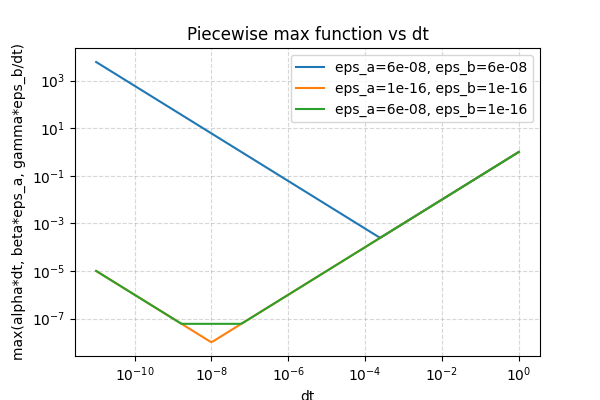

# Discretization Error

Consider solving the ODE

```{math}
:label: eq:ode
\newcommand{\fd}[2]{\frac{\mathrm{d}#1}{\mathrm{d}#2}}
\newcommand{\fdd}[2]{\frac{\mathrm{d}^2#1}{\mathrm{d}#2^2}}
\newcommand{\dt}{\Delta t}
\frac{\mathrm{d}y}{\mathrm{d}t} = f(y, t)
```

numerically using explcit Euler time integration.

Then at each timestep, we find $y(t)$ at the next timestep $y^+=y(t+\dt)$ from

```{math}
:label: eq:explicit_euler
y^+ = y + \dt\ f(y,t) 
```

If we integrate this over $N$ timesteps to time $T = N\dt$,
then this algorithm is a loop that will have an accumulation error that depends on $N$ and on the precision.
But there is also a **discretization error** from making the approximation

$$
\fd{y}{t} \approx \frac{y^+ - y}{\dt}.
$$

Explicit Euler is a first-order accurate method, that is, its error is linear in $\dt$. 
We can see this by expanding $y^+=y(t+\dt)$ using Taylor's series, and using the Lagrange form, such that there is a $\xi\in(t, t+\dt)$ such that

$$
y^+ = y(t + \dt) = y(t) + \dt\ \fd{y(t)}{t} + \frac{\dt^2}{2!} \fdd{y(\xi)}{t}
$$

Rearranging, we have

$$
\frac{y^+-y}{\dt} = \fd{y}{t} + \dt \left(\frac{1}{2} \left.\fdd{y}{t}\right|_{t=\xi}\right) 
$$

Thus we can model the discretization error by adding a term $C\dt^2$ into the time integration loop:

$$
y^+ = y + \dt\ f(y,t) + C \dt^2
$$

The term $C\dt^2$ is the **local truncation error**. 
Performing this loop over a fixed time interval $T=N\dt$, this error contributes

$$
C N \dt^2 = C T \dt.
$$

This is the **global discretization error**, the total error from the time discretization, over the whole time integration.

## Accumulation error vs discretization error

In integrating {eq}`eq:ode` using the explicit Euler method {eq}`eq:explicit_euler`, we have two sources of error, accumulation and discretization, yielding three terms

```{math}
:label: eq:errors
CT \dt,
~~~~~~~~
N\varepsilon_{a} \dt A,
~~~~~~~~
\varepsilon_{b} \left(N B + \frac{N(N+1)}{2}\ \dt A\right).
```

where $\varepsilon_a$ and $\varepsilon_b$ correspond to the precision used ($\varepsilon_{a} = \varepsilon_b = \varepsilon_{32}$ in single precision, $\varepsilon_{a} = \varepsilon_b = \varepsilon_{64}$ in double precision, and $\varepsilon_{a} = \varepsilon_{32}$, $\varepsilon_b = \varepsilon_{64}$ in mixed precision).
Here, we have used $x_0 = y(t=0) = B$ as the initial value for the sum accumulation, and $dx = \dt A$ in the error terms, with $A$ characterizing the absolute value of $y(t)$ over the loop. This might be made rigorous by treating the errors as bounds, with $A$ an upper bound of the absolute value of $y(t)$.

In our problem, we are interested in integrating over a fixed time interval $T = N\dt$, so our errors can be expressed in terms of a single parameter.
Writing the errors solely in terms of $\dt = T/N$, we have 

```{math}
:label: eq:errors_dt
CT \dt,
~~~~~~~~
\varepsilon_{a} T A,
~~~~~~~~
\varepsilon_{b} \left( \frac{BT}{\dt} + \frac{AT^2}{2\dt} \right).
```

To simplify, we write these as
```{math}
:label: eq:errors_final
\alpha \dt,
~~~~~~~~
\beta \varepsilon_{a},
~~~~~~~~
\frac{\gamma\varepsilon_{b}}{\dt}.
```



This figure plots the errors schematically for single precision (blue), double precision (orange) and mixed precision (green) using parameter values $\alpha = \beta = \gamma = 1$.

At large $\dt$, we expect discretization error $CT\dt$ to dominate, irrespective of precision.
At small $\dt$, we expect the accumulation error $\gamma\varepsilon_b/\dt$ to dominate, with different magnitude depending on precision.
Depending on parameter values, we may see a flat region in the middle.
This flat region is the only difference between mixed and double precision, and represents the floor in attainable accuracy $\sim 10^{-8}$ from using single precision.
